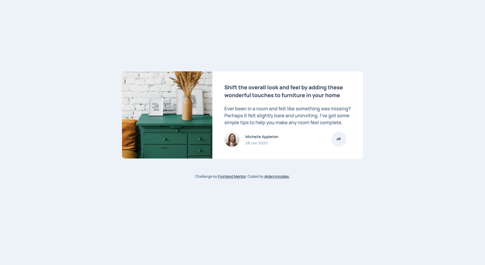
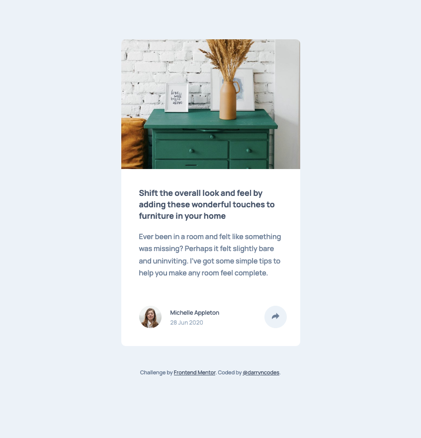
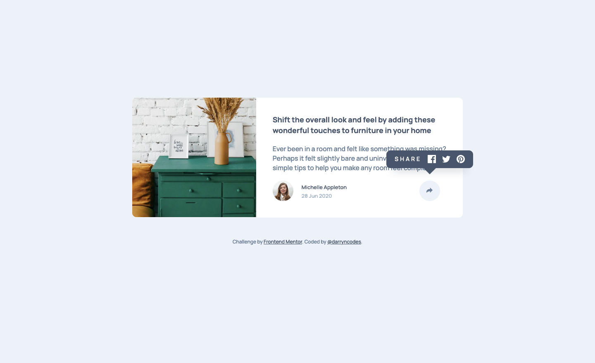
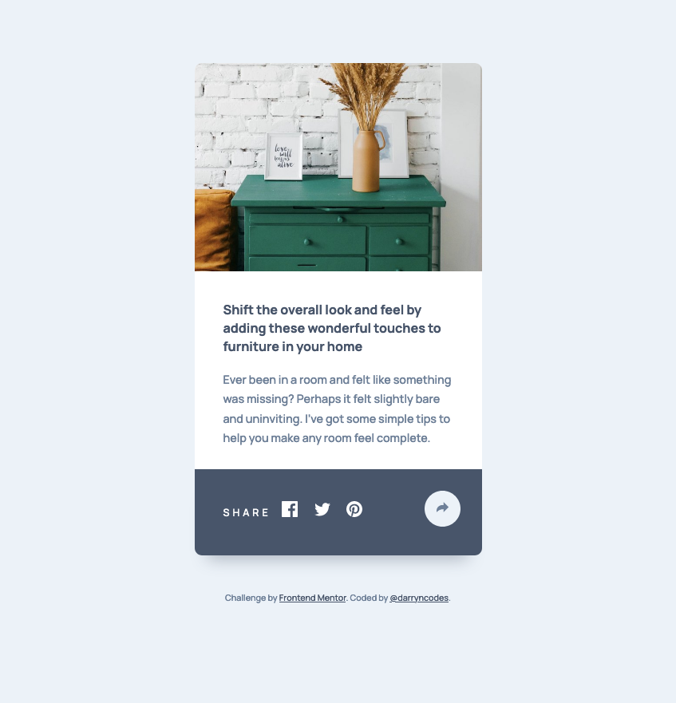

# Frontend Mentor - Article preview component solution

This is a solution to the [Article preview component challenge on Frontend Mentor](https://www.frontendmentor.io/challenges/article-preview-component-dYBN_pYFT). Frontend Mentor challenges help you improve your coding skills by building realistic projects.

## Table of contents

- [Overview](#overview)
  - [The challenge](#the-challenge)
  - [Screenshot](#screenshot)
  - [Links](#links)
- [My process](#my-process)
  - [Built with](#built-with)
  - [Continued development](#continued-development)
  - [Useful resources](#useful-resources)
- [Author](#author)

## Overview

### The challenge

Users should be able to:

- View the optimal layout for the component depending on their device's screen size
- See the social media share links when they click the share icon

### Screenshot

### Links

- [GitHub repo](https://github.com/darryncodes/article-preview-component)
- [Solution URL](https://darryncodes.github.io/article-preview-component/)
- [Live Site URL](https://www.darryncodes.co.uk/pages/article-preview-component.html)

## My process

### Built with

- Semantic HTML5 markup
- SASS
- Flexbox
- CSS Grid
- JS
- BEM methodology

### Continued development

Mobile-first development approach...

### Useful resources

- [CSS speech bubbles made easy](https://projects.verou.me/bubbly/)
- [Toggle show/Hide element](https://css-tricks.com/snippets/javascript/showhide-element/)
- [How to - CSS/JS Modal](https://www.w3schools.com/howto/howto_css_modals.asp)

## Author

- Work in progress portfolio site - [@darryncodes](https://www.darryncodes.co.uk/)
- Frontend Mentor - [@darryncodes](https://www.frontendmentor.io/profile/darryncodes)
